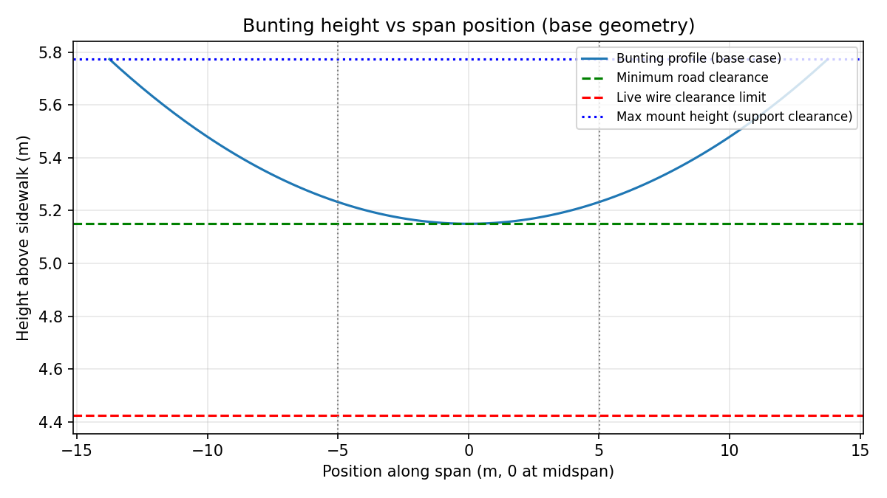
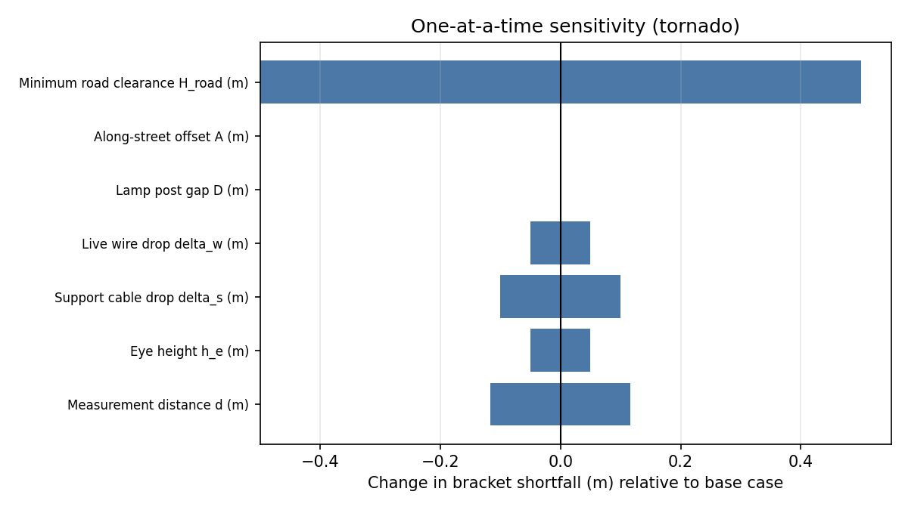

# Bunting Clearance Feasibility Report

## Mathematical model

Let the horizontal measurement distance be $d$, the angle up from horizontal be $\theta$, and eye height be $h_e$.

The lamp-post bracket height is:

$$H_b = h_e + d\tan(\theta)$$

The support cable mount height at the powerline attachment point is:

$$H_s = H_b - \Delta_s$$

The live wire height is:

$$H_w = H_s - \Delta_w$$

The minimum allowed bunting height above sidewalk is:

$$H_{min} = H_{road} + H_{crown}$$

Let the across-street lamp-post gap be $D$ and the along-street offset be $A$.

The bunting span length is:

$$L = \sqrt{D^2 + A^2}$$

The bunting sag is modeled as a symmetric catenary with endpoints at equal height.

With $x=0$ at midspan, the catenary is:

$$z(x) = a\cosh(x/a) - a$$

The endpoint sag is $S = z(L/2)$, and the endpoint (mount) height is $H_m$.

Thus the midspan (lowest point) height is $H_m - S$ and must satisfy:

$$H_m - S \ge H_{min} \quad\Rightarrow\quad H_m \ge H_{min} + S$$

The live wires cross the bunting at fraction $t = g/D$ along the straight-line span, where $g$ is the horizontal offset from lamp post to the powerline mount.

The distance from midspan is:

$$s = |t - 1/2|L$$

The bunting height at the wire crossing is:

$$H_{cross} = H_m - S + z(s)$$

Clearance constraints are enforced as:

$$H_m \le H_b - C_s$$

$$H_{cross} \le H_w - C_w$$

The catenary parameter $a$ is related to horizontal tension $H$ and weight per unit length $w$ by:

$$a = H / w, \quad w = m_{bunting} g$$

## Inputs (meters unless noted)
- Measurement distance to bracket: 9.100
- Measurement angle: 25.000 deg
- Eye height: 1.830
- Powerline mount offset from post: 6.000
- Support cable drop: 0.500
- Live wire drop below support: 0.150
- Clearance to support cable: 0.300
- Clearance to live wire: 1.000
- Minimum road clearance: 5.000
- Road crown above sidewalk: 0.150
- Bunting mass per length: 0.020 kg/m
- Gravity: 9.810 m/s^2

## Case definitions
| Case | Lamp post gap D (m) | Along-street offset A (m) |
| --- | --- | --- |
| 1100/1000 | 18.900 | 20.000 |
| 900 | 15.000 | 17.000 |
| 800 | 12.100 | 15.000 |

## Case results
| Case | Span L (m) | Wire height H_w (m) | Required wire height (m) | Wire shortfall (m) | Min horizontal tension (N) | Verdict |
| --- | --- | --- | --- | --- | --- | --- |
| 1100/1000 | 27.517 | 5.423 | 6.150 | 0.727 | n/a | Not feasible |
| 900 | 22.672 | 5.423 | 6.150 | 0.727 | n/a | Not feasible |
| 800 | 19.272 | 5.423 | 6.150 | 0.727 | n/a | Not feasible |

## Base-case derived geometry (1100/1000)
- Bracket height: 6.073 m
- Support cable height at powerline mount: 5.573 m
- Live wire height: 5.423 m
- Minimum bunting height above sidewalk: 5.150 m
- Bunting span length: 27.517 m
- Distance from midspan to live-wire crossing: 5.023 m

## Feasibility checks (base case)
- Even with zero sag (perfectly taut bunting), feasibility still fails because live wire height is below the required clearance.
- Best-case required live wire height (road clearance + 1.0 m): 6.150 m
- Best-case required bracket height: 6.800 m
- Live wire shortfall vs best case: 0.727 m
- Bracket height shortfall vs best case: 0.727 m

## Sensitivity analysis: measurement angle +/-1 deg (base case)
| Angle (deg) | Bracket height (m) | Live wire height (m) | Required bracket height (m) | Bracket shortfall (m) | Height-only feasible |
| --- | --- | --- | --- | --- | --- |
| 24.000 | 5.882 | 5.232 | 6.800 | 0.918 | False |
| 25.000 | 6.073 | 5.423 | 6.800 | 0.727 | False |
| 26.000 | 6.268 | 5.618 | 6.800 | 0.532 | False |

## Multi-parameter sweep (base case, 7 parameters, 3 levels each)
- Total combinations: 2187
- Feasible combinations (best-case height-only check): 27
- Minimum bracket shortfall: -0.090 m
- Maximum bracket shortfall: 1.543 m

Best-case parameter set (minimum shortfall):
- measurement_distance_m: 9.350
- eye_height_m: 1.880
- support_cable_drop_m: 0.400
- live_wire_drop_below_support_m: 0.100
- lamp_post_gap_m: 17.900
- bunting_offset_along_m: 19.000
- min_road_clearance_m: 4.500
- Shortfall: -0.090 m

One-at-a-time sensitivity highlight:
- Largest bracket shortfall range: Minimum road clearance H_road (m) (1.000 m)

## Sensitivity parameter ranges used and rationale
- Measurement distance d: base +/-0.25 m to reflect tape/pace error; affects bracket height via d*tan(theta).
- Eye height h_e: base +/-0.05 m to reflect stance/grade differences; shifts bracket height directly.
- Support cable drop delta_s: base +/-0.10 m to reflect tension/sag uncertainty; shifts wire height.
- Live wire drop delta_w: base +/-0.05 m to reflect hardware variation; shifts wire height.
- Lamp-post gap D: base +/-1.0 m to reflect block-to-block spacing variance; changes span and crossing location.
- Along-street offset A: base +/-1.0 m to reflect layout constraints; changes span and crossing location.
- Minimum road clearance H_road: 4.5 to 5.5 m to reflect possible requirement changes.

## Plots (base case)

## Conclusion
- 1100/1000: Not feasible
- 900: Not feasible
- 800: Not feasible

## Assumptions and notes
- The bracket height computed from the angle measurement is the lamp post support cable mount.
- Support cable drop of 0.50 m occurs over the 6.0 m horizontal gap to the powerline mount.
- Live wires are 0.15 m below the support cable at the mount point.
- Clearance requirements are enforced at the exact plan intersections with live wires.
- The multi-parameter sweep uses a best-case height-only check (no catenary feasibility scan).
